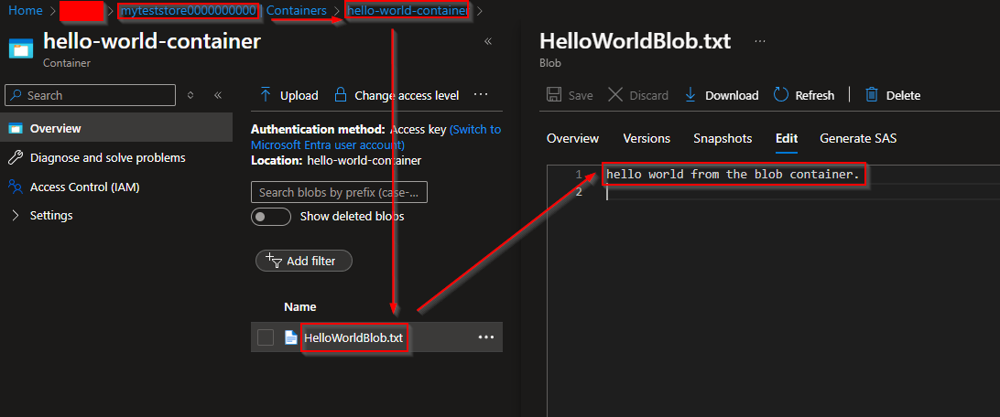

# Purpose

The purpose of this example is to demonstrate how to use a user assigned managed identity from a virtual machine with a storage account.

# How we do this

We do this by using terraform to create:

- The virtual machine.
- The storage account.
- The managed identity.
- The RBAC role assigned to the managed identity with `Storage Blob Data Contributor`.

We then will then use the `az cli` to:

1. Authenticate with the managed identity.
1. Create a storage blob container called `hello-world-container` and storage blob file called `HelloWorldBlob.txt`.

# Prerequisites

Ensure that you have:

1. An existing resource group.
1. An existing subnet id.
1. Terraform CLI installed.

# Running the example

To run this example:

1. Provide the resource group you want to put the virtual machine and it's components into.
1. Provide the subnet id you want to attach the virtual machine to.
1. Optionally-- depending on your subnet range, you may have to change the `azurerm_network_interface.example.ip_configuration.private_ip_address` value.
1. Create a `terraform.tfvars` file and populate that file with the appropriate input variables (for resource group and subnet id).
1. Run `terraform plan` to check the resources which are about to be made.
1. Run `terraform apply -auto-approve` to provision the virtual machine.
1. SSH into the virtual machine. There is a script called `jump.sh` which is offered which prints out the password (we're not worried about the data on the ephemeral VM) for ease. You can use `jump.sh` to quickly jump into the VM.
1. Copy the `request.sh` to your virtual machine and ensure it is executable with `chmod u+x requests.sh`.
1. Run the script `./request.sh` and it will tell you the parameters you need to enter. It will essentially:
   - Authenticate with the managed identity.
   - Create a blob container named `hello-world-container`.
   - Create a new blob inside the `hello-world-container` called `HelloWorldBlob.txt`.
1. You should see output similar to this:
   
1. Exit the connection from the session with `ctrl+d`.
1. Run `terraform apply -auto-approve -destroy` to clean up the resources we created.
